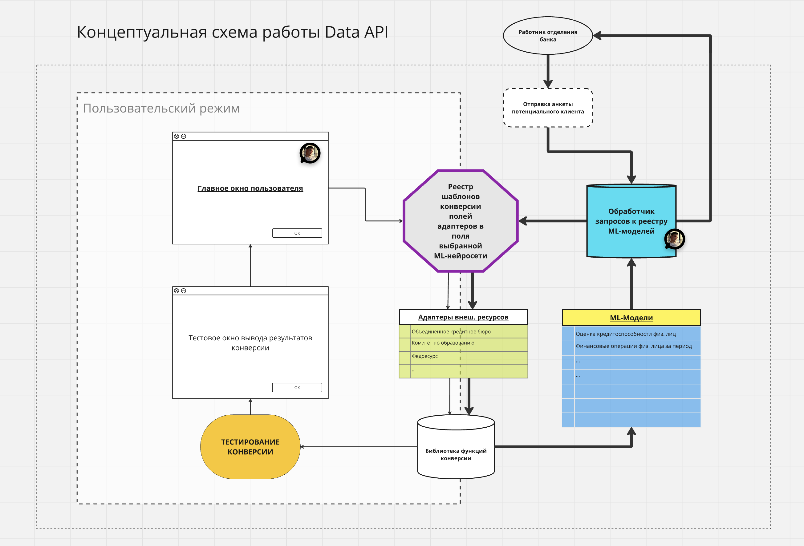
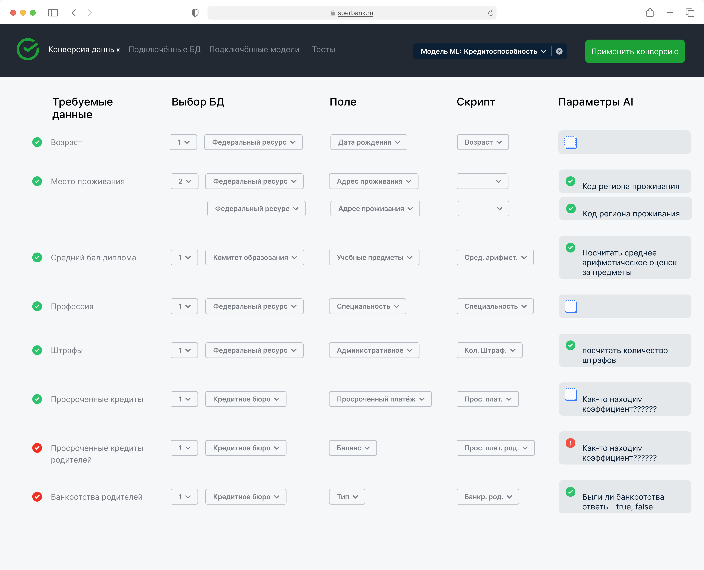
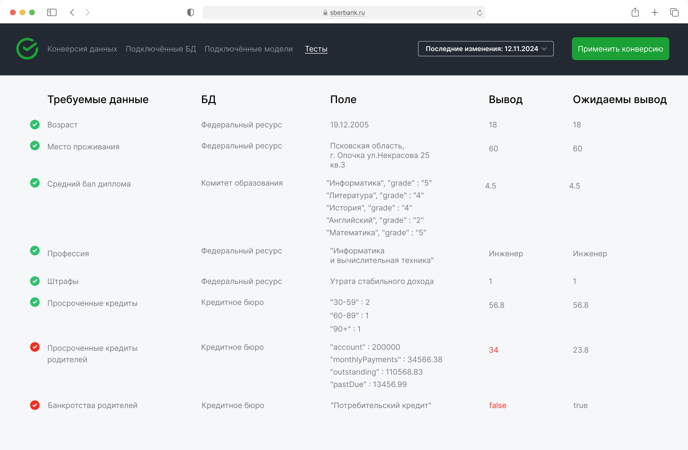
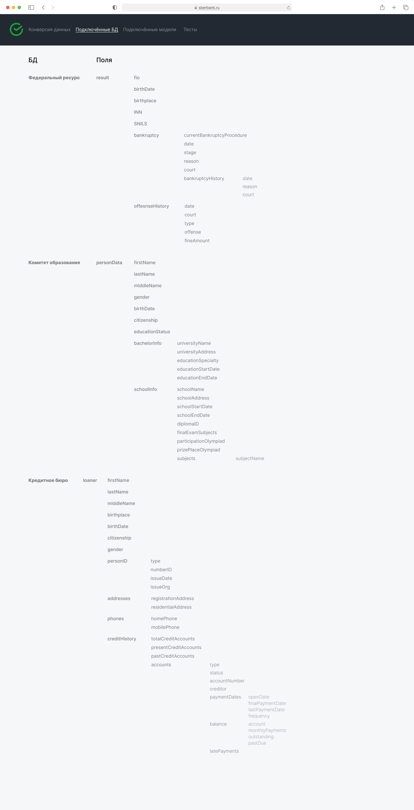

# Hack-Change24

## Описание проекта

Hack-Change24 — инструмент (Data API), который ускорит и упростит подключение источников данных к ML-моделям, минимизировав время и трудозатраты для внедрения новых ML моделей (time-to-market)

---

## Структура проекта

```
Hack-Change24-main
├── api/            # API
├── cmd/            # Основные команды для запуска приложения
├── examples/       # База данных
├── frontend/       # Файлы фронтенда
├── internal/       # Внутренняя бизнес-логика
├── main.py         # Основной файл приложения (backend)
├── go.mod          # Информация о зависимостях для Go
├── go.sum          # Контрольная сумма модулей
```

---

## Шаги для запуска

### 1. Установка зависимостей

#### Python:
- Убедитесь, что установлен Python 3.8+.
- Установите зависимости из файла `requirements.txt`:


#### Go:
- Убедитесь, что установлен Go 1.21.6+.

### 2. Запуск проекта

   - проект собирается из корневой директории командой
    ```go build cmd/server.go```
    запуск командой 
    ```./server```

    сервер запускается на localhost:8080

    Фронтенд ещё не подключен к бекенду
    Web интерфейс можно загрузить из докера
    командой
    docker run -p 3000:3000 poudrefr/react-json-uploader
    он будет находиться по адресу localhost:3000


## Команда и роли

- **[Имя 1]** — Team Lead, разработка backend.
- **[Имя 2]** — Frontend-разработчик.
- **[Имя 3]** — UX/UI дизайнер.
- **[Имя 4]** — Data Scientist, обработка данных.

---

## Иллюстрации

### Схема работы программы:


### Интерфейс программы:




---

## Описание API

несколько эндпоинтов для передачи списков схем  и маппинга.
Он использует Gorilla Mux для маршрутизации запросов.

### Маршруты
Статус
Метод: GET
Путь: /status
Назначение: Получить текущий статус сервера (всегда возвращает 200)

### Список баз данных
Метод: GET
Путь: /db_list
Назначение: Отдаёт схемы доступных баз данных (всегда возвращает "examples/credit_form_schem.json",
                                                              	"examples/education_departmen_schem.json",
                                                              	"examples/fedresource_schem.json",
                                                              	"examples/UCB_schem.json",
                                                              })

### Список маппингов
Метод: GET
Путь: /ml_list
Назначение: Отдаёт схемы доступных ML моделей (всегда возвращает "examples/model_schem.json"})

### Создание маппинга
Метод: POST
Путь: /create_mapping
Назначение: Создать новый маппинг между базами данных 


### Выполнение запроса
Метод: POST
Путь: /perform_request
Назначение: Выполнить запрос к целевой базе данных через созданный маппинг

### Примечания

Для POST /perform_request запроса ожидается JSON-тело с необходимыми данными. (например credit_form_2.json)
Возвращаемые данные форматируются в JSON для удобства обработки на клиенте.

JSON из фронтенда приходит с структурой файлов в виде: # первый - название базы данных
                                                       # второй - поля базы данных
                                                       # третий - текстовый запрос к AI Агенту для конвертации
                                                       # остальные промпт для AI Агента

### Ошибки

API использует стандартные HTTP-коды состояния ошибок:

400: Некорректный запрос

----

## Интерфейс

Нужно выбрать json файл примера запроса к ML (например test.json)
далее для каждого поля нужно выбрать файл ответа базы данных (например credit_form.json)
в выподаюшем окне выбираем поля из баз данных
по нажатию кнопки свормируется json со сценариями маппинга (но это не тот json который необходим для /perform_request)))
